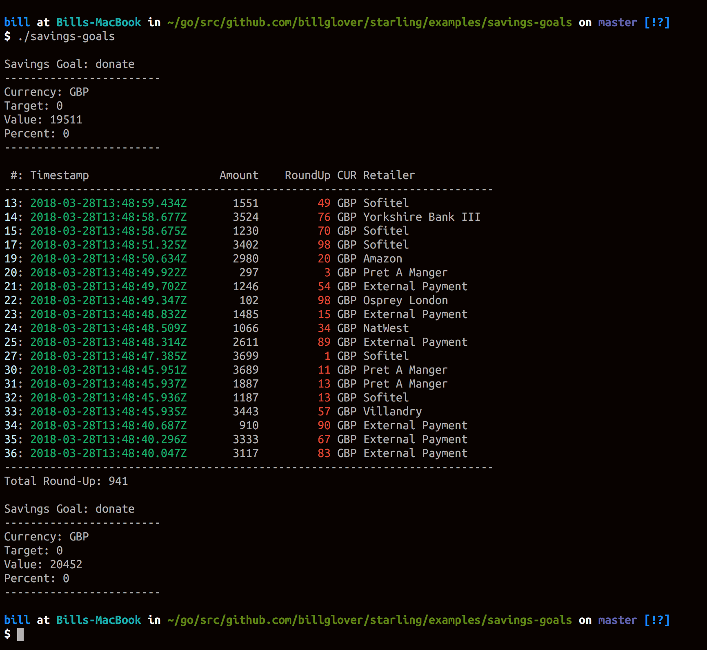

# poc

A proof of concept showing how it may be possible to round-up daily transactions

## Screenshot

## Features

* look for a savings account called 'donate'
* if the account doesn't exist, create one
* request transactions for the last day
* round up each transaction to the nearest major unit (e.g. £1, 1$, etc.)
* compute the total value of the round-up
* transfer the round-up to the savings account
